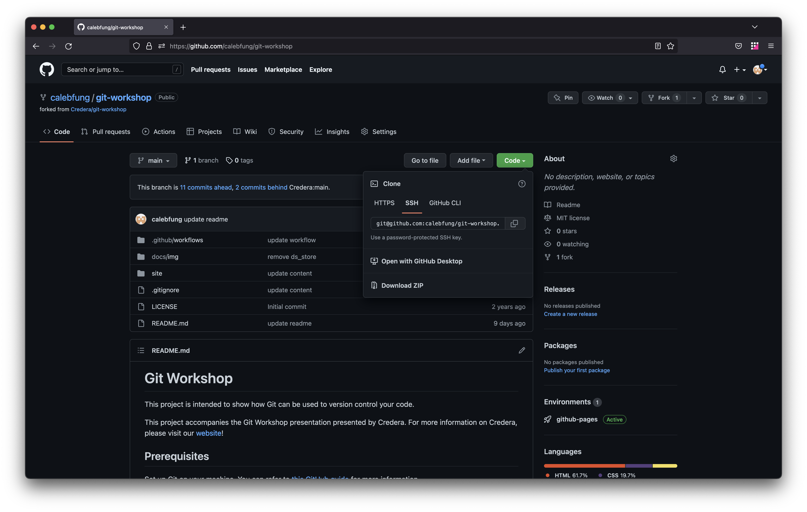
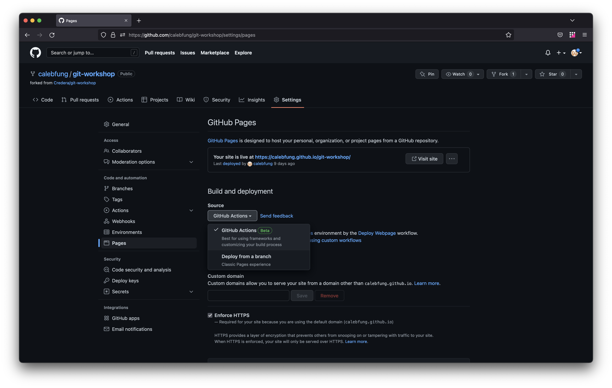
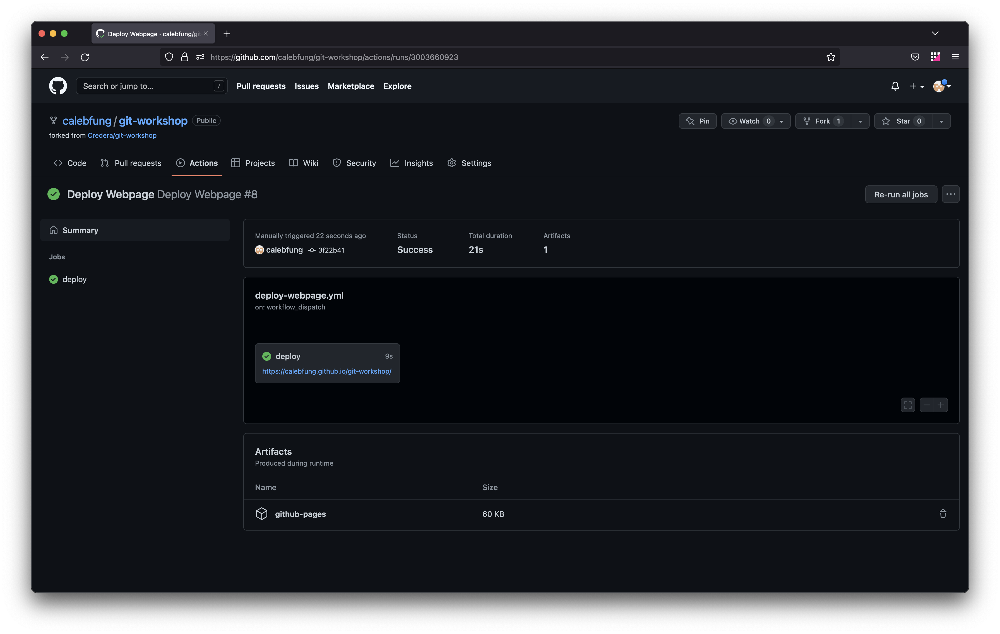

# Git Workshop

This project is intended to show how Git can be used to version control your code.

This project accompanies the Git Workshop presentation presented by Credera. For more information on Credera, please visit our [website](https://credera.com/)!

## Prerequisites

Set up Git on your machine. You can refer to [this GitHub guide](https://docs.github.com/en/get-started/quickstart/set-up-git) for more information.

## Setup

[Fork](https://docs.github.com/en/get-started/quickstart/fork-a-repo) this repository in GitHub. This creates a copy of the original repository so that you can make changes to your own copy.


Then, [clone](https://docs.github.com/en/repositories/creating-and-managing-repositories/cloning-a-repository) the repository. Cloning the repository downloads the project files from GitHub to your local machine so you can work on the project locally before pushing changes back up to GitHub.



Enable [GitHub Pages](https://pages.github.com/). We'll be using GitHub Pages to host the webpage contents stored in this repository.



## Workshop Steps

### Project Overview

Let's take a look at the current state of the project.

Make sure your project branch is set to `main`. Git Branches can be used to modify your code without affecting other branched versions of the code. For more information on Git branches, check out [this helpful guide on GitHub](https://docs.github.com/es/pull-requests/collaborating-with-pull-requests/proposing-changes-to-your-work-with-pull-requests/about-branches).

There are two main portions: `site`, `docs`, and `.github`.
  * `site` contains the website contents.
  * `docs` contains documentation contents.
  * `.github` contains GitHub Actions contents.
We'll focus on the `site` portion for this workshop.

### Deploy the Website

To see what we're working with, we can deploy the current state of the website through [GitHub Actions](https://github.com/features/actions).

Head over to the Actions tab and click on the Deploy Webpage workflow. Then, click on the "Run workflow" dropdown and click on the "Run workflow" button.


After the deploy job completes, you should see a link to the website. You can click on the link to view your deployed website.



### Add a New Feature

We can use [feature branches](https://www.atlassian.com/git/tutorials/comparing-workflows/feature-branch-workflow) to add new features to the website.

Let's create a new feature branch to add another paragraph to the website. In your terminal, create a feature branch called `feature/tacocat`.

```
git checkout -b feature/tacocat
```

Copy the following block of text:

```
Tacocat chambray vexillologist, gentrify meh street art marfa pour-over pin air plant echo park. Fixie poke la croix mustache. Fam mumblecore retro unicorn pug forage pinterest everyday carry jianbing 3 wolf moon cliche neutra. Pug selvage snackwave four loko cliche irony gentrify vibecession messenger bag 3 wolf moon. Celiac heirloom tattooed twee kickstarter bespoke hammock cloud bread stumptown vape cred beard. Gochujang truffaut chartreuse williamsburg tbh man braid pug craft beer meh big mood jean shorts cronut slow-carb.
```

Then, paste in under in the section that contains the following:

```html
<p><!-- REPLACE ME --></p>
```

Let's also update the webpage title to make it more accurate.

```html
<h1>Tacos and More!</h1>
```

To track this change in the Git history, we can [add the change and commit it](https://www.atlassian.com/git/tutorials/saving-changes).

```
git add site/index.html
git commit -m "add tacocat content"
```

We need to push the changes to the newly created branch up from our local machine so GitHub has a copy of it.

```
git push --set-upstream origin feature/tacocat
```

Let's create a [pull request](https://docs.github.com/en/pull-requests/collaborating-with-pull-requests/proposing-changes-to-your-work-with-pull-requests/about-pull-requests) to review and merge the changes to the `main` branch.

Typically, pull requests are used to review and discuss changes before merging them in to the main branch.

After you merge in the pull request, you can head over to the Deploy Webpage GitHub Actions workflow and see it automatically run. After the workflow completes, head over to the deployed webpage and confirm that the tacocat content has been added.

### Handle a Merge Conflict

If you followed the setup instructions, you should see a branch called `feature/taco-image`. This branch adds an an image of a taco to the website.

Update the following line from

```html

```

to the following

```html

```

We can try and create a pull request for the `feature/taco-image` branch; however, we'll soon find out the GitHub shows that there are merge conflicts between the `feature/taco-image` branch and the `main` branch. Merge conflicts may happen when team members are working on the same parts of a project and make conflicting changes. We'll need to manually resolve these conflicts before we are able to merge in the changes.

Check out the `main` branch.

```
git checkout main
```

Pull in the latest changes for the `main` branch.

```
git pull
```

Check out the `feature/taco-image` branch.


```
git checkout feature/taco-image
```

Add in the more up-to-date changes from the `main` branch into the `feature/taco-image` branch.


```
git rebase master
```

You'll see an error indicating a merge conflict in the webpage title. Let's use the version of the title from the `main` branch. The title of the webpage should look like the following:


```html
<h1>My Taco Blog!</h1>
```

Add the resolved conflict change and continue adding in the changes from the `main` branch.


```
git add site/index.html
git rebase --continue

```

After all changes from the `main` branch are added to the `feature/taco-image` branch, we'll need to push up the changes,


```
git push --force-with-lease
```

Typically, you don't want to force push local changes up. But because we modified the history of the `feature/taco-image` branch, we'll need to let GitHub know that our local version of the branch is the right one to use. Ususally, you'll need to force push changes up after rebasing. 

Now that we've pushed up our changes with the merge conflict resolved, we can merge the pull request.


After the Deploy Webpage GitHub Actions workflow completes, head over to the deployed webpage and confirm that the taco image has been added.

## Additional Git Concepts

* View Git history with [`git log`](https:/the/git-scm.com/docs/git-log)
* [Rebase commits](https://docs.github.com/en/get-started/using-git/about-git-rebase)
  * Squash commits
  * Reword commit messages
* Find a commit where a bug was introduced with [`git bisect`](https://git-scm.com/docs/git-bisect)
